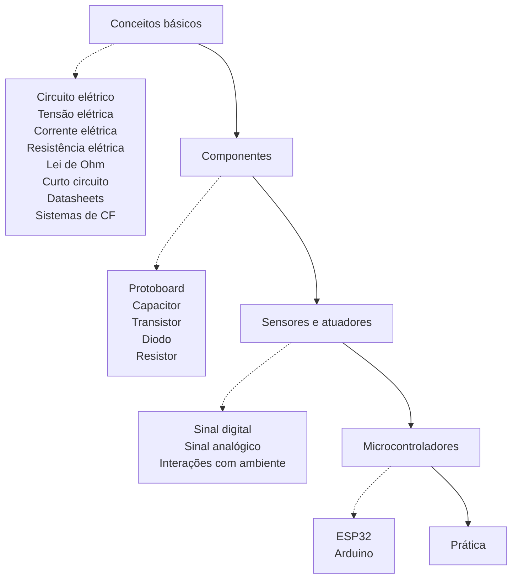

# Eletrônica básica

## Roadmap

[](https://mermaid.live/edit#pako:eNplk89O3DAQxl_F8pntodz2gAQbkJBArAi3ZCVm7WHXIrajsSNUIR4G9VC114onyIsxjpPNluYQ2b_5PN-M_7xK5TXKpXxq_IvaA0XxUNRO8Ke8U2iiD1UtHzNaGVIdI4FN_zuSUT7zB3Sh_zljGOWeCF3Er_wegwmx_-OUga-xGzRCo7jb2zFHR-ynRuPMCogQ9ogx5HnJ2dBCSAtXV5k91nJTu6kT285NrMlHv_VAenSAFhTnprEXApfKm-aF8dof1z0Fjh1KdOdxtiiNg0ZoszMRmmME_Ov_7g4bd827Q9D_6j8wpDIF2K1JW_a_hTWK_GxxWa5Pv-fhOenOOH-8ZMBi8W1xNh9jphcTte3YfgZDB2PHmQyGY6pqNWUR2_49cP1hIxYsuuCIbb1LNYfNwYIjq4pTBk_cGAqIHeg03hxMWVJUt8mDK4zkm38ExSC4rNbUv0e-HIzlibRIFozm6_qaZLWMe7RYyyUPNdBzLWv3xjrooi9_OCWXkTo8kV2rIWJhYEdg5fIJmsAUdTr123z_h2fw9gmYtADE)

1. Conceitos básicos (ver o que serve em https://github.com/FNakano/CFA/blob/master/eletricidade.md e em https://github.com/FNakano/CFA/blob/master/circuitosEletricos.md)
    1. Circuito elétrico
    2. Tensão elétrica (V)
    3. Corrente elétrica (A)
    4. Resistência elétrica (Ω)
    5. Lei de Ohm
    6. Curto circuito
    7. Datasheet
    8. Sistemas de computação física
2. Componentes
    1. Protoboard ( ver o que serve em: https://github.com/FNakano/CFA/blob/master/componentes/interconexoes/README.md)
    2. Capacitor
    3. Transistor (https://github.com/FNakano/OAC1/blob/main/oProblema.md#indo-um-pouco-al%C3%A9m-do-vestibular , https://github.com/FNakano/OAC1/blob/main/oProblema.md)
    4. Diodo
       - Light Emitting Diode (LED) (https://github.com/FNakano/OAC1/blob/main/oProblema.md#l%C3%A2mpada-comparada-ao-led)
    6. Resistor
3. Sensores e atuadores
    1. Sinal digital (https://github.com/FNakano/CFA/tree/master/componentes/protocolos)
    2. Sinal analógico
        1. ADC (Analog to Digital Converter)
        2. DAC (Digital to Analog Converter)
        3. PWM (Pulse Width Modulation)
    4. Diferentes componentes para o ambiente
        1. Buzzer (emissão de som)
        2. Display OLED (Emissão de luz em pixels numa tela)
        3. LED (Emissão de luz)
        4. LED RGB (Emissão de luz de diferentes cores)
        5. Servo motor (Movimentação)
        6. LDR 3mm 3547-2 (Medição de Luminosidade) (https://arduinoeach.wordpress.com/2018/04/20/code-ldr-e-teremim/)
        7. LM35 (Medição de Temperatura)
        8. TTP223B (Sensor de toque)
        9. TCRT5000 (Medição e emissão de infravermelho)
4. Microcontroladores
    1. ESP32
        1. Pinagem
        2. Linguagens de programação
            1. MicroPython (https://docs.micropython.org/en/latest/esp32/quickref.html)
            2. Arduino IDE (https://espressif-docs.readthedocs-hosted.com/projects/arduino-esp32/en/latest/installing.html)
        3. Burn firmware
        4. Manipulação de documentos com a placa
            1. Thonny (https://thonny.org , https://randomnerdtutorials.com/getting-started-thonny-micropython-python-ide-esp32-esp8266/)
            2. Ampy
            3. Arduino IDE
        5. Simulação (Wokwi)
    2. Arduino
        1. Simulação (Tinkercad)

## Desafios

### Desafio 1

No pino 2 do ESP32, há um led embutido! No REPL, faça um blink (ou seja, faça este led piscar - seu valor deve alterar entre 0 e 1 a cada x segundos)

Após fazer no REPL, coloque este código em um arquivo e o envie para a plaquinha para que seja executado sempre que ela executar.

### Desafio 2

Crie um circuito com um led e crie o programa para fazer o blink funcionar

### Desafio 3

Crie um sistema de computação física com dois sensores e dois atuadores

### Desafio 4

Refaça o circuito do desafio 3 sem alterar a funcionalidade do sistema


## Gabaritos

### Desafio 1

```py
import machine
import time
led = machine.Pin(PINO, machine.Pin.OUT) # PINO é qualquer pino que você conectou o LED
while True:
	led.value(1)
	time.sleep(1)
	led.value(0)
	time.sleep(1)
```

### Desafio 2

```py
# PINO1 E PINO2 são quaisquer pinos que você conectou os componentes

import machine
touch = machine.Pin(PINO1, machine.Pin.IN) 
led = machine.Pin(PINO2, machine.Pin.OUT)
while True:
	if touch.value() == 1:
		led.on()
	else:
		led.off()
```

## Materiais complementares
- [Introdução à microcontroladores com ESP 32 - PET-SI](https://github.com/owlficinas/Microcontroladores-ESP32/tree/master)

## código fonte do roadmap



